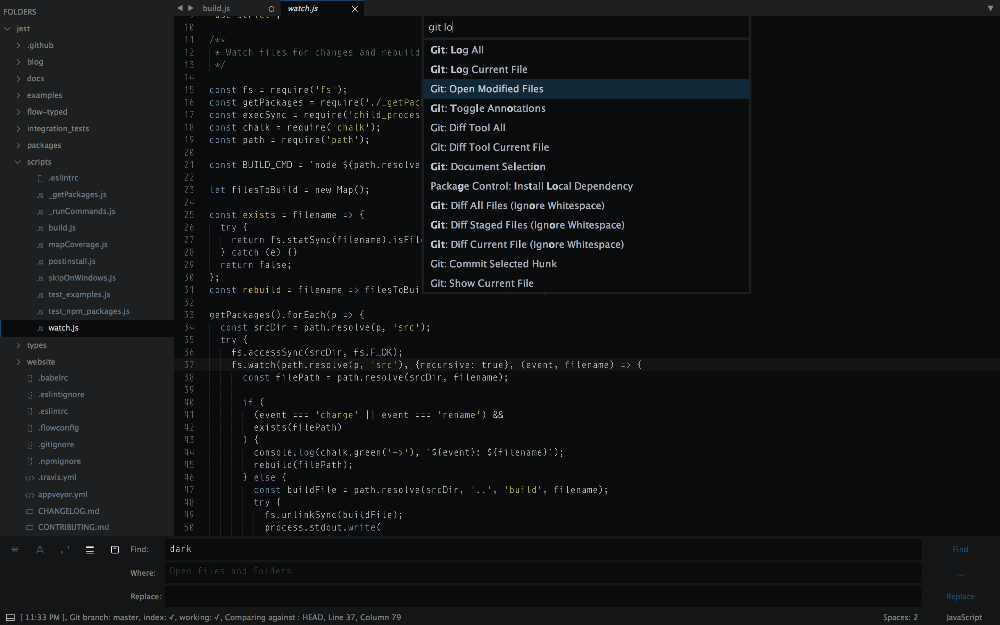
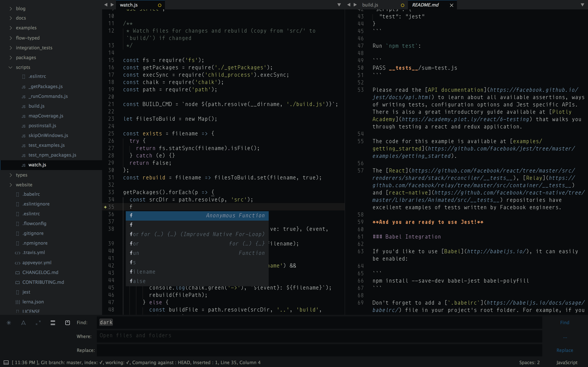
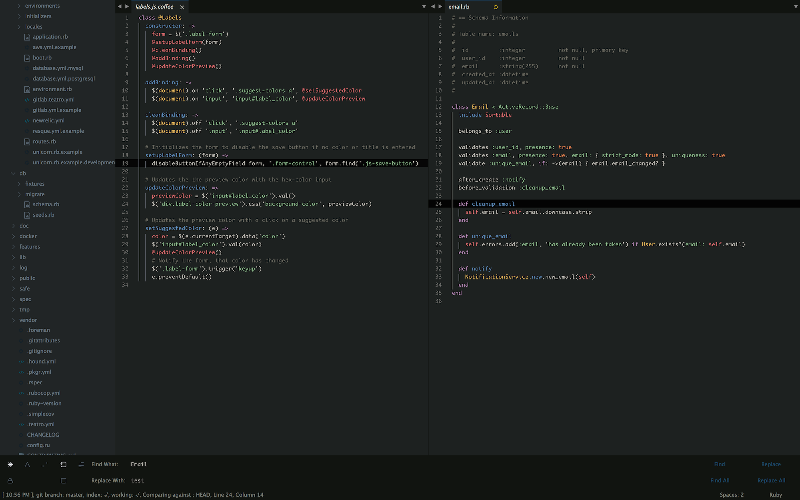
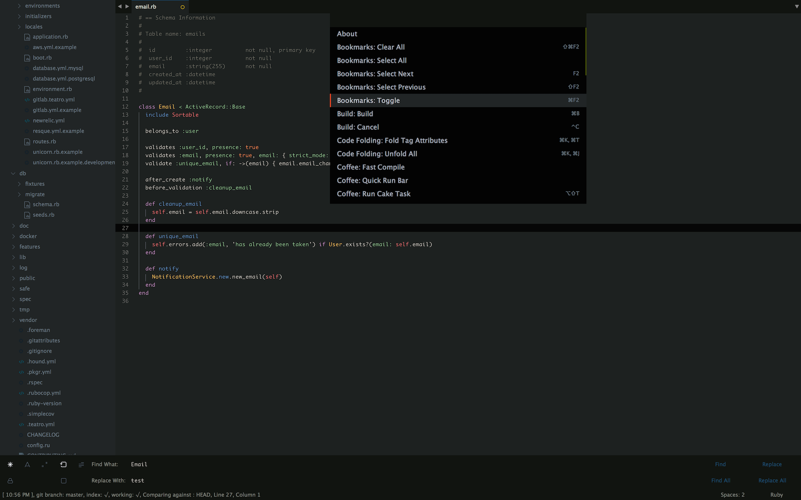

# Midnight theme for sublime text

A dark UI and similarly styled color scheme for making it easier on the eyes. It comes in two flavors.
The first one is dark theme called `dark` and the second one is darker in nature called `hybrid` but easier on the eyes.

## Installation

### Activating Theme

To activate the theme, open up user preferences file by clicking `Sublime Text menu -> Preferences -> Settings - User`.
There are two different dark themes, `dark` and `hybrid`.

To activate dark theme, put the following in the Preferences file.
```
"theme": "Midnight-dark.sublime-theme",
```

To activate hybrid theme, put the following in the Preferences file.
```
"theme": "Midnight-hybrid.sublime-theme",
```

### Activating color scheme

There are 2 different color schemes that go hand in hand with two different themes provided.
If you are using `dark` theme, please use `dark` color scheme and if you are using `hybrid` theme, its gonna be much better if you use `hybrid` color scheme.

The easiest way to enable a color scheme is by going to
`Sublime Text Menu -> Preferences -> Color Scheme -> Theme - Midnight -> Midnight.(dark|hybrid)`.

### Example settings
Choose the theme you like and put the code in your preferences file.

#### Hybrid theme & color scheme
```
"color_scheme": "Packages/Theme - Midnight/Midnight.hybrid.tmTheme",
"theme": "Midnight-hybrid.sublime-theme"
```

#### Dark theme & color scheme
```
"color_scheme": "Packages/Theme - Midnight/Midnight.dark.tmTheme",
"theme": "Midnight-dark.sublime-theme"
```

## Screenshots

### Hybrid theme and its color scheme



### Dark theme and its color scheme



__Thank you__

It would not have been possible to pursue this project without the influence of the following projects.
Many thanks.
* [Spacegray](https://github.com/kkga/spacegray)
* [Cobalt2](https://github.com/wesbos/cobalt2)
* [Seti ST3](https://github.com/ctf0/Seti_ST3)
